## Turbo 2000 Sport (211-280)

### My collection

|       Year        |                                                                                                                1                                                                                                                 |                                                                                                                2                                                                                                                 |                                                                                                                3                                                                                                                 |                                                                                                                4                                                                                                                 |                                                                                                                5                                                                                                                 |
|:-----------------:|:--------------------------------------------------------------------------------------------------------------------------------------------------------------------------------------------------------------------------------:|:--------------------------------------------------------------------------------------------------------------------------------------------------------------------------------------------------------------------------------:|:--------------------------------------------------------------------------------------------------------------------------------------------------------------------------------------------------------------------------------:|:--------------------------------------------------------------------------------------------------------------------------------------------------------------------------------------------------------------------------------:|:--------------------------------------------------------------------------------------------------------------------------------------------------------------------------------------------------------------------------------:|
| 2000 04 - 2001 04 |  |  |  |  |  |

	<a href='https://raw.githubusercontent.com/vlegchilkin/collection/2362283a52140b2a2aacd7455df0d0a70ee271ff/gum_wrappers/kent/turbo/2000/211-280/inner/211.5.png' title=''>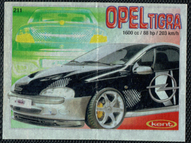</a>

	

	

	<a href='https://raw.githubusercontent.com/vlegchilkin/collection/2362283a52140b2a2aacd7455df0d0a70ee271ff/gum_wrappers/kent/turbo/2000/211-280/inner/214.4.png' title=''>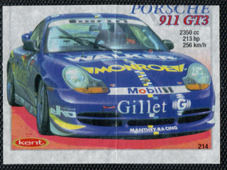</a>

	

	

	

	

	

	

	

	

	<a href='https://raw.githubusercontent.com/vlegchilkin/collection/2362283a52140b2a2aacd7455df0d0a70ee271ff/gum_wrappers/kent/turbo/2000/211-280/inner/223.5.png' title=''>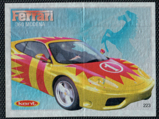</a>

	<a href='https://raw.githubusercontent.com/vlegchilkin/collection/2362283a52140b2a2aacd7455df0d0a70ee271ff/gum_wrappers/kent/turbo/2000/211-280/inner/224.5.png' title=''>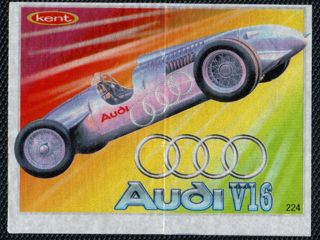</a>

	

	

	<a href='https://raw.githubusercontent.com/vlegchilkin/collection/2362283a52140b2a2aacd7455df0d0a70ee271ff/gum_wrappers/kent/turbo/2000/211-280/inner/227.5.png' title=''>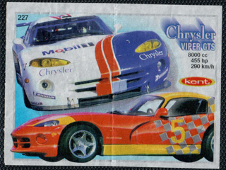</a>

	

	

	

	

	

	

	<a href='https://raw.githubusercontent.com/vlegchilkin/collection/2362283a52140b2a2aacd7455df0d0a70ee271ff/gum_wrappers/kent/turbo/2000/211-280/inner/234.5.png' title=''>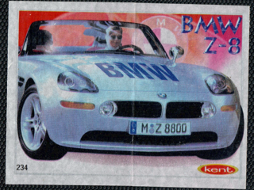</a>

	

	

	

	

	

	

	

	<a href='https://raw.githubusercontent.com/vlegchilkin/collection/2362283a52140b2a2aacd7455df0d0a70ee271ff/gum_wrappers/kent/turbo/2000/211-280/inner/242.5.png' title=''>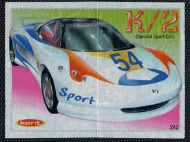</a>

	

	

	

	

	

	

	

	<a href='https://raw.githubusercontent.com/vlegchilkin/collection/2362283a52140b2a2aacd7455df0d0a70ee271ff/gum_wrappers/kent/turbo/2000/211-280/inner/250.5.png' title=''>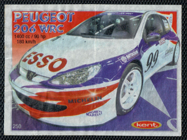</a>

	

	<a href='https://raw.githubusercontent.com/vlegchilkin/collection/2362283a52140b2a2aacd7455df0d0a70ee271ff/gum_wrappers/kent/turbo/2000/211-280/inner/252.5.png' title=''>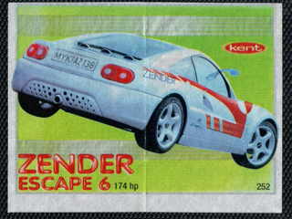</a>

	

	

	

	

	

	<a href='https://raw.githubusercontent.com/vlegchilkin/collection/2362283a52140b2a2aacd7455df0d0a70ee271ff/gum_wrappers/kent/turbo/2000/211-280/inner/258.5.png' title=''>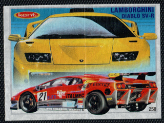</a>

	

	

	<a href='https://raw.githubusercontent.com/vlegchilkin/collection/2362283a52140b2a2aacd7455df0d0a70ee271ff/gum_wrappers/kent/turbo/2000/211-280/inner/261.5.png' title=''>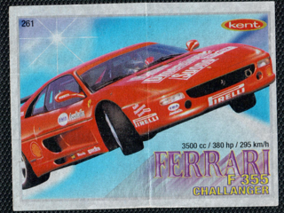</a>

	

	<a href='https://raw.githubusercontent.com/vlegchilkin/collection/2362283a52140b2a2aacd7455df0d0a70ee271ff/gum_wrappers/kent/turbo/2000/211-280/inner/263.5.png' title=''>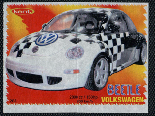</a>

	

	

	

	<a href='https://raw.githubusercontent.com/vlegchilkin/collection/2362283a52140b2a2aacd7455df0d0a70ee271ff/gum_wrappers/kent/turbo/2000/211-280/inner/267.5.png' title=''>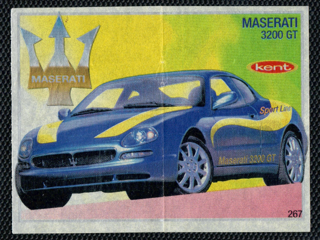</a>

	

	

	

	

	

	

	

	

	

	

	

	<a href='https://raw.githubusercontent.com/vlegchilkin/collection/2362283a52140b2a2aacd7455df0d0a70ee271ff/gum_wrappers/kent/turbo/2000/211-280/inner/279.5.png' title=''>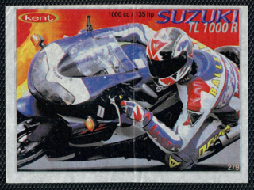</a>

	

