## Turbo 2000 Super (71-140)

### My collection

|       Year        |                                                                                                                1                                                                                                                |                                                                                                                2                                                                                                                |                                                                                                                3                                                                                                                |                                                                                                                4                                                                                                                |                                                                                                                5                                                                                                                |
|:-----------------:|:-------------------------------------------------------------------------------------------------------------------------------------------------------------------------------------------------------------------------------:|:-------------------------------------------------------------------------------------------------------------------------------------------------------------------------------------------------------------------------------:|:-------------------------------------------------------------------------------------------------------------------------------------------------------------------------------------------------------------------------------:|:-------------------------------------------------------------------------------------------------------------------------------------------------------------------------------------------------------------------------------:|:-------------------------------------------------------------------------------------------------------------------------------------------------------------------------------------------------------------------------------:|
| 1999 07 - 2001 04 |  | [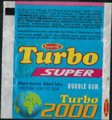](https://raw.githubusercontent.com/vlegchilkin/collection/72ea4904c00de34bffa663b01aea77c22424e4cb/gum_wrappers/kent/turbo/2000/71-140/outer/1999_07_-_2001_04.2.5.png) |  |  |  |

	

	<a href='https://raw.githubusercontent.com/vlegchilkin/collection/2362283a52140b2a2aacd7455df0d0a70ee271ff/gum_wrappers/kent/turbo/2000/71-140/inner/72.5.png' title=''>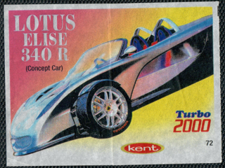</a>

	

	

	

	<a href='https://raw.githubusercontent.com/vlegchilkin/collection/2362283a52140b2a2aacd7455df0d0a70ee271ff/gum_wrappers/kent/turbo/2000/71-140/inner/76.5.png' title=''>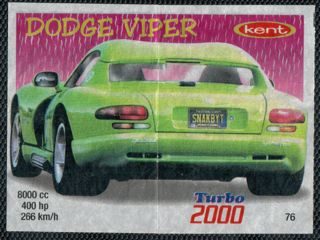</a>

	<a href='https://raw.githubusercontent.com/vlegchilkin/collection/2362283a52140b2a2aacd7455df0d0a70ee271ff/gum_wrappers/kent/turbo/2000/71-140/inner/77.5.png' title=''>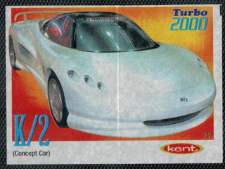</a>

	

	

	

	<a href='https://raw.githubusercontent.com/vlegchilkin/collection/2362283a52140b2a2aacd7455df0d0a70ee271ff/gum_wrappers/kent/turbo/2000/71-140/inner/81.5.png' title=''>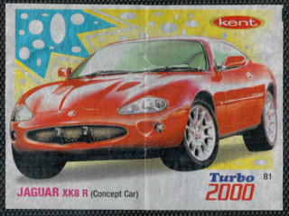</a>

	

	

	

	<a href='https://raw.githubusercontent.com/vlegchilkin/collection/2362283a52140b2a2aacd7455df0d0a70ee271ff/gum_wrappers/kent/turbo/2000/71-140/inner/85.5.png' title=''>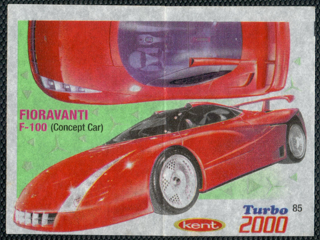</a>

	

	

	<a href='https://raw.githubusercontent.com/vlegchilkin/collection/2362283a52140b2a2aacd7455df0d0a70ee271ff/gum_wrappers/kent/turbo/2000/71-140/inner/88.4.png' title=''>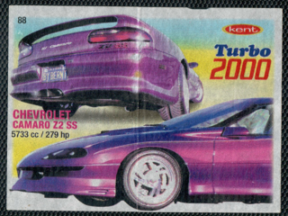</a>

	<a href='https://raw.githubusercontent.com/vlegchilkin/collection/2362283a52140b2a2aacd7455df0d0a70ee271ff/gum_wrappers/kent/turbo/2000/71-140/inner/89.5.png' title=''>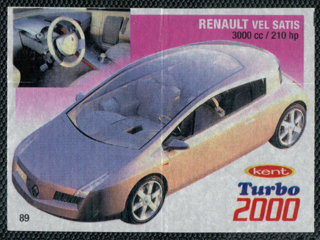</a>

	

	

	

	

	

	

	

	

	

	<a href='https://raw.githubusercontent.com/vlegchilkin/collection/2362283a52140b2a2aacd7455df0d0a70ee271ff/gum_wrappers/kent/turbo/2000/71-140/inner/99.5.png' title=''>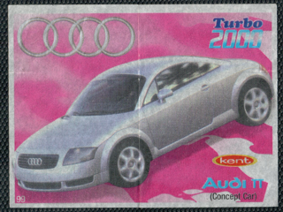</a>

	

	

	

	

	

	<a href='https://raw.githubusercontent.com/vlegchilkin/collection/2362283a52140b2a2aacd7455df0d0a70ee271ff/gum_wrappers/kent/turbo/2000/71-140/inner/105.5.png' title=''>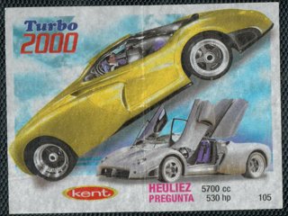</a>

	

	

	

	

	

	

	<a href='https://raw.githubusercontent.com/vlegchilkin/collection/2362283a52140b2a2aacd7455df0d0a70ee271ff/gum_wrappers/kent/turbo/2000/71-140/inner/112.5.png' title=''>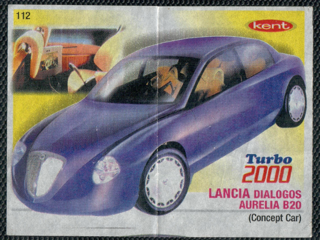</a>

	<a href='https://raw.githubusercontent.com/vlegchilkin/collection/2362283a52140b2a2aacd7455df0d0a70ee271ff/gum_wrappers/kent/turbo/2000/71-140/inner/113.5.png' title=''>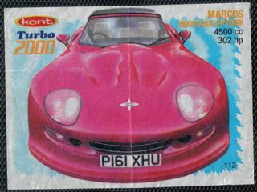</a>

	

	

	<a href='https://raw.githubusercontent.com/vlegchilkin/collection/2362283a52140b2a2aacd7455df0d0a70ee271ff/gum_wrappers/kent/turbo/2000/71-140/inner/116.4.png' title=''>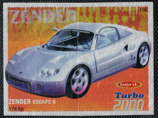</a>

	<a href='https://raw.githubusercontent.com/vlegchilkin/collection/2362283a52140b2a2aacd7455df0d0a70ee271ff/gum_wrappers/kent/turbo/2000/71-140/inner/117.4.png' title=''>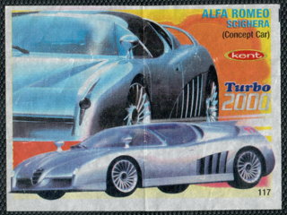</a>

	

	

	

	<a href='https://raw.githubusercontent.com/vlegchilkin/collection/2362283a52140b2a2aacd7455df0d0a70ee271ff/gum_wrappers/kent/turbo/2000/71-140/inner/121.5.png' title=''>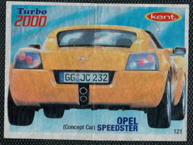</a>

	

	

	<a href='https://raw.githubusercontent.com/vlegchilkin/collection/2362283a52140b2a2aacd7455df0d0a70ee271ff/gum_wrappers/kent/turbo/2000/71-140/inner/124.5.png' title=''>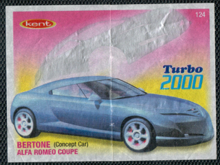</a>

	

	

	

	

	

	

	

	

	

	

	

	

	

	

	<a href='https://raw.githubusercontent.com/vlegchilkin/collection/2362283a52140b2a2aacd7455df0d0a70ee271ff/gum_wrappers/kent/turbo/2000/71-140/inner/139.5.png' title=''>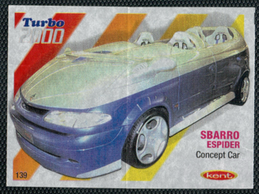</a>

	<a href='https://raw.githubusercontent.com/vlegchilkin/collection/2362283a52140b2a2aacd7455df0d0a70ee271ff/gum_wrappers/kent/turbo/2000/71-140/inner/140.5.png' title=''>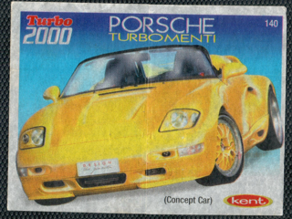</a>

