## Turbo 2003 TUR Super (1-99)

### My collection

|  Year   |                                                                                                       1                                                                                                        |                                                                                                       2                                                                                                        |                                                                                                       3                                                                                                        |                                                                                                       4                                                                                                        |                                                                                                       5                                                                                                        |
|:-------:|:--------------------------------------------------------------------------------------------------------------------------------------------------------------------------------------------------------------:|:--------------------------------------------------------------------------------------------------------------------------------------------------------------------------------------------------------------:|:--------------------------------------------------------------------------------------------------------------------------------------------------------------------------------------------------------------:|:--------------------------------------------------------------------------------------------------------------------------------------------------------------------------------------------------------------:|:--------------------------------------------------------------------------------------------------------------------------------------------------------------------------------------------------------------:|
| 2006 02 |  |  |  |  |  |

	<a href='https://raw.githubusercontent.com/vlegchilkin/collection/a9406052fbc31e4ae95d9bcf9c918656ecd1f513/gum_wrappers/kent/turbo/2003/TUR/super/inner/1.5.png' title=''>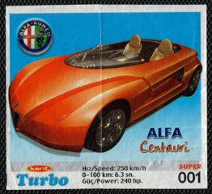</a>

	<a href='https://raw.githubusercontent.com/vlegchilkin/collection/a9406052fbc31e4ae95d9bcf9c918656ecd1f513/gum_wrappers/kent/turbo/2003/TUR/super/inner/2.5.png' title=''>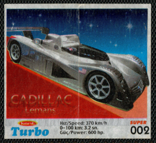</a>

	<a href='https://raw.githubusercontent.com/vlegchilkin/collection/a9406052fbc31e4ae95d9bcf9c918656ecd1f513/gum_wrappers/kent/turbo/2003/TUR/super/inner/3.4.png' title=''>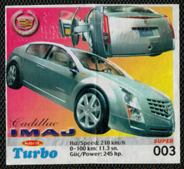</a>

	<a href='https://raw.githubusercontent.com/vlegchilkin/collection/a9406052fbc31e4ae95d9bcf9c918656ecd1f513/gum_wrappers/kent/turbo/2003/TUR/super/inner/4.4.png' title=''>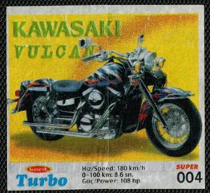</a>

	<a href='https://raw.githubusercontent.com/vlegchilkin/collection/a9406052fbc31e4ae95d9bcf9c918656ecd1f513/gum_wrappers/kent/turbo/2003/TUR/super/inner/5.5.png' title=''>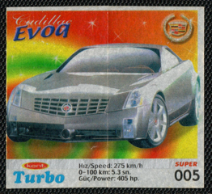</a>

	<a href='https://raw.githubusercontent.com/vlegchilkin/collection/a9406052fbc31e4ae95d9bcf9c918656ecd1f513/gum_wrappers/kent/turbo/2003/TUR/super/inner/6.4.png' title=''>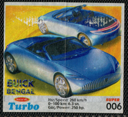</a>

	<a href='https://raw.githubusercontent.com/vlegchilkin/collection/a9406052fbc31e4ae95d9bcf9c918656ecd1f513/gum_wrappers/kent/turbo/2003/TUR/super/inner/7.5.png' title=''>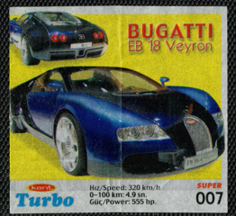</a>

	<a href='https://raw.githubusercontent.com/vlegchilkin/collection/a9406052fbc31e4ae95d9bcf9c918656ecd1f513/gum_wrappers/kent/turbo/2003/TUR/super/inner/8.5.png' title=''>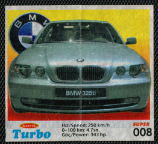</a>

	<a href='https://raw.githubusercontent.com/vlegchilkin/collection/a9406052fbc31e4ae95d9bcf9c918656ecd1f513/gum_wrappers/kent/turbo/2003/TUR/super/inner/9.5.png' title=''>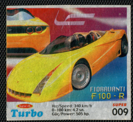</a>

	<a href='https://raw.githubusercontent.com/vlegchilkin/collection/a9406052fbc31e4ae95d9bcf9c918656ecd1f513/gum_wrappers/kent/turbo/2003/TUR/super/inner/10.5.png' title=''>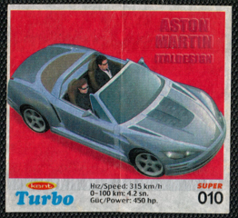</a>

	<a href='https://raw.githubusercontent.com/vlegchilkin/collection/a9406052fbc31e4ae95d9bcf9c918656ecd1f513/gum_wrappers/kent/turbo/2003/TUR/super/inner/11.5.png' title=''>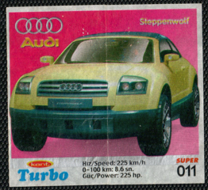</a>

	<a href='https://raw.githubusercontent.com/vlegchilkin/collection/a9406052fbc31e4ae95d9bcf9c918656ecd1f513/gum_wrappers/kent/turbo/2003/TUR/super/inner/12.5.png' title=''>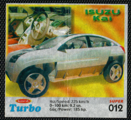</a>

	<a href='https://raw.githubusercontent.com/vlegchilkin/collection/a9406052fbc31e4ae95d9bcf9c918656ecd1f513/gum_wrappers/kent/turbo/2003/TUR/super/inner/13.5.png' title=''>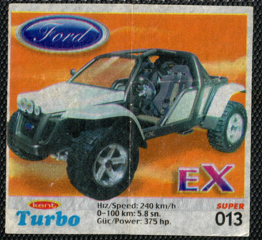</a>

	<a href='https://raw.githubusercontent.com/vlegchilkin/collection/a9406052fbc31e4ae95d9bcf9c918656ecd1f513/gum_wrappers/kent/turbo/2003/TUR/super/inner/14.5.png' title=''>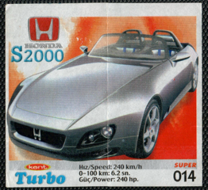</a>

	<a href='https://raw.githubusercontent.com/vlegchilkin/collection/a9406052fbc31e4ae95d9bcf9c918656ecd1f513/gum_wrappers/kent/turbo/2003/TUR/super/inner/15.5.png' title=''>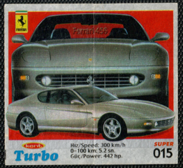</a>

	<a href='https://raw.githubusercontent.com/vlegchilkin/collection/a9406052fbc31e4ae95d9bcf9c918656ecd1f513/gum_wrappers/kent/turbo/2003/TUR/super/inner/16.5.png' title=''>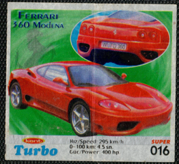</a>

	<a href='https://raw.githubusercontent.com/vlegchilkin/collection/a9406052fbc31e4ae95d9bcf9c918656ecd1f513/gum_wrappers/kent/turbo/2003/TUR/super/inner/17.5.png' title=''>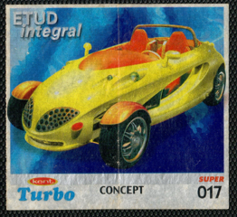</a>

	<a href='https://raw.githubusercontent.com/vlegchilkin/collection/a9406052fbc31e4ae95d9bcf9c918656ecd1f513/gum_wrappers/kent/turbo/2003/TUR/super/inner/18.5.png' title=''>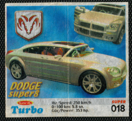</a>

	<a href='https://raw.githubusercontent.com/vlegchilkin/collection/a9406052fbc31e4ae95d9bcf9c918656ecd1f513/gum_wrappers/kent/turbo/2003/TUR/super/inner/19.4.png' title=''>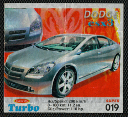</a>

	<a href='https://raw.githubusercontent.com/vlegchilkin/collection/a9406052fbc31e4ae95d9bcf9c918656ecd1f513/gum_wrappers/kent/turbo/2003/TUR/super/inner/20.4.png' title=''>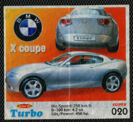</a>

	<a href='https://raw.githubusercontent.com/vlegchilkin/collection/a9406052fbc31e4ae95d9bcf9c918656ecd1f513/gum_wrappers/kent/turbo/2003/TUR/super/inner/21.5.png' title=''>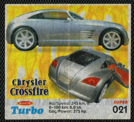</a>

	<a href='https://raw.githubusercontent.com/vlegchilkin/collection/a9406052fbc31e4ae95d9bcf9c918656ecd1f513/gum_wrappers/kent/turbo/2003/TUR/super/inner/22.4.png' title=''>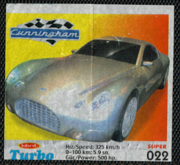</a>

	<a href='https://raw.githubusercontent.com/vlegchilkin/collection/a9406052fbc31e4ae95d9bcf9c918656ecd1f513/gum_wrappers/kent/turbo/2003/TUR/super/inner/23.5.png' title=''>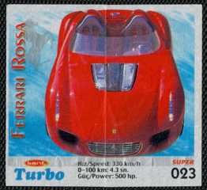</a>

	

	

	<a href='https://raw.githubusercontent.com/vlegchilkin/collection/a9406052fbc31e4ae95d9bcf9c918656ecd1f513/gum_wrappers/kent/turbo/2003/TUR/super/inner/26.4.png' title=''>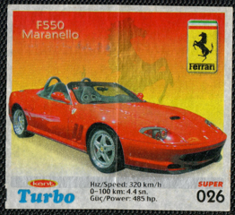</a>

	<a href='https://raw.githubusercontent.com/vlegchilkin/collection/a9406052fbc31e4ae95d9bcf9c918656ecd1f513/gum_wrappers/kent/turbo/2003/TUR/super/inner/27.5.png' title=''>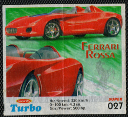</a>

	<a href='https://raw.githubusercontent.com/vlegchilkin/collection/a9406052fbc31e4ae95d9bcf9c918656ecd1f513/gum_wrappers/kent/turbo/2003/TUR/super/inner/28.5.png' title=''>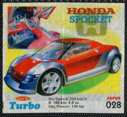</a>

	<a href='https://raw.githubusercontent.com/vlegchilkin/collection/a9406052fbc31e4ae95d9bcf9c918656ecd1f513/gum_wrappers/kent/turbo/2003/TUR/super/inner/29.5.png' title=''>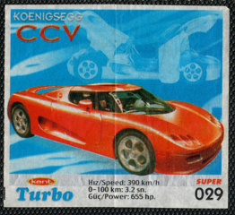</a>

	

	<a href='https://raw.githubusercontent.com/vlegchilkin/collection/a9406052fbc31e4ae95d9bcf9c918656ecd1f513/gum_wrappers/kent/turbo/2003/TUR/super/inner/31.4.png' title=''>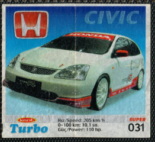</a>

	<a href='https://raw.githubusercontent.com/vlegchilkin/collection/a9406052fbc31e4ae95d9bcf9c918656ecd1f513/gum_wrappers/kent/turbo/2003/TUR/super/inner/32.5.png' title=''>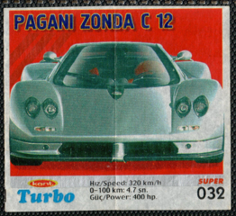</a>

	<a href='https://raw.githubusercontent.com/vlegchilkin/collection/a9406052fbc31e4ae95d9bcf9c918656ecd1f513/gum_wrappers/kent/turbo/2003/TUR/super/inner/33.5.png' title=''>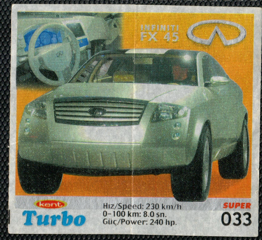</a>

	<a href='https://raw.githubusercontent.com/vlegchilkin/collection/a9406052fbc31e4ae95d9bcf9c918656ecd1f513/gum_wrappers/kent/turbo/2003/TUR/super/inner/34.5.png' title=''>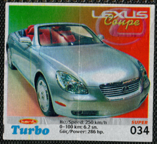</a>

	<a href='https://raw.githubusercontent.com/vlegchilkin/collection/a9406052fbc31e4ae95d9bcf9c918656ecd1f513/gum_wrappers/kent/turbo/2003/TUR/super/inner/35.4.png' title=''>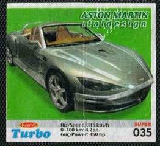</a>

	<a href='https://raw.githubusercontent.com/vlegchilkin/collection/a9406052fbc31e4ae95d9bcf9c918656ecd1f513/gum_wrappers/kent/turbo/2003/TUR/super/inner/36.4.png' title=''>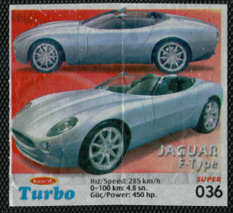</a>

	<a href='https://raw.githubusercontent.com/vlegchilkin/collection/a9406052fbc31e4ae95d9bcf9c918656ecd1f513/gum_wrappers/kent/turbo/2003/TUR/super/inner/37.4.png' title=''>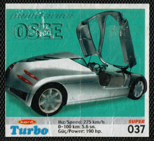</a>

	<a href='https://raw.githubusercontent.com/vlegchilkin/collection/a9406052fbc31e4ae95d9bcf9c918656ecd1f513/gum_wrappers/kent/turbo/2003/TUR/super/inner/38.5.png' title=''>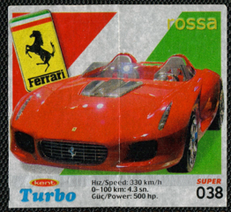</a>

	

	<a href='https://raw.githubusercontent.com/vlegchilkin/collection/a9406052fbc31e4ae95d9bcf9c918656ecd1f513/gum_wrappers/kent/turbo/2003/TUR/super/inner/40.4.png' title=''>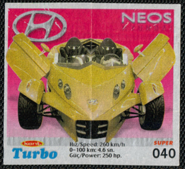</a>

	<a href='https://raw.githubusercontent.com/vlegchilkin/collection/a9406052fbc31e4ae95d9bcf9c918656ecd1f513/gum_wrappers/kent/turbo/2003/TUR/super/inner/41.5.png' title=''>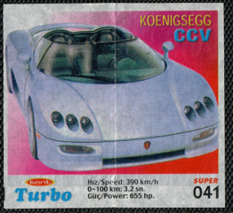</a>

	

	<a href='https://raw.githubusercontent.com/vlegchilkin/collection/a9406052fbc31e4ae95d9bcf9c918656ecd1f513/gum_wrappers/kent/turbo/2003/TUR/super/inner/43.4.png' title=''>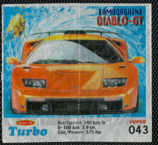</a>

	

	<a href='https://raw.githubusercontent.com/vlegchilkin/collection/a9406052fbc31e4ae95d9bcf9c918656ecd1f513/gum_wrappers/kent/turbo/2003/TUR/super/inner/45.4.png' title=''>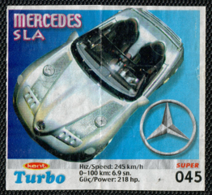</a>

	<a href='https://raw.githubusercontent.com/vlegchilkin/collection/a9406052fbc31e4ae95d9bcf9c918656ecd1f513/gum_wrappers/kent/turbo/2003/TUR/super/inner/46.4.png' title=''>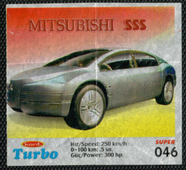</a>

	<a href='https://raw.githubusercontent.com/vlegchilkin/collection/a9406052fbc31e4ae95d9bcf9c918656ecd1f513/gum_wrappers/kent/turbo/2003/TUR/super/inner/47.4.png' title=''>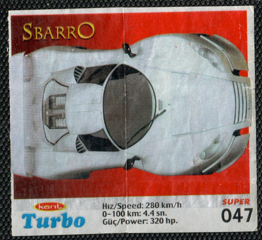</a>

	<a href='https://raw.githubusercontent.com/vlegchilkin/collection/a9406052fbc31e4ae95d9bcf9c918656ecd1f513/gum_wrappers/kent/turbo/2003/TUR/super/inner/48.4.png' title=''>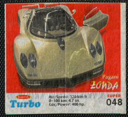</a>

	

	<a href='https://raw.githubusercontent.com/vlegchilkin/collection/a9406052fbc31e4ae95d9bcf9c918656ecd1f513/gum_wrappers/kent/turbo/2003/TUR/super/inner/50.4.png' title=''>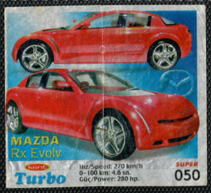</a>

	<a href='https://raw.githubusercontent.com/vlegchilkin/collection/a9406052fbc31e4ae95d9bcf9c918656ecd1f513/gum_wrappers/kent/turbo/2003/TUR/super/inner/51.3.png' title=''>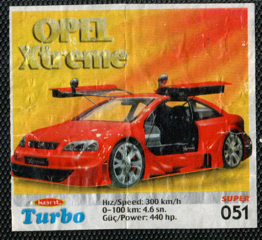</a>

	<a href='https://raw.githubusercontent.com/vlegchilkin/collection/a9406052fbc31e4ae95d9bcf9c918656ecd1f513/gum_wrappers/kent/turbo/2003/TUR/super/inner/52.4.png' title=''>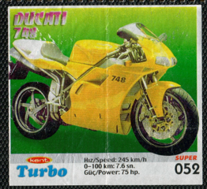</a>

	<a href='https://raw.githubusercontent.com/vlegchilkin/collection/a9406052fbc31e4ae95d9bcf9c918656ecd1f513/gum_wrappers/kent/turbo/2003/TUR/super/inner/53.4.png' title=''>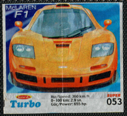</a>

	<a href='https://raw.githubusercontent.com/vlegchilkin/collection/a9406052fbc31e4ae95d9bcf9c918656ecd1f513/gum_wrappers/kent/turbo/2003/TUR/super/inner/54.4.png' title=''>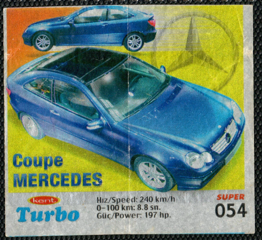</a>

	<a href='https://raw.githubusercontent.com/vlegchilkin/collection/a9406052fbc31e4ae95d9bcf9c918656ecd1f513/gum_wrappers/kent/turbo/2003/TUR/super/inner/55.5.png' title=''>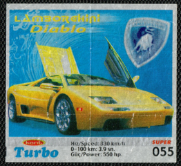</a>

	<a href='https://raw.githubusercontent.com/vlegchilkin/collection/a9406052fbc31e4ae95d9bcf9c918656ecd1f513/gum_wrappers/kent/turbo/2003/TUR/super/inner/56.4.png' title=''>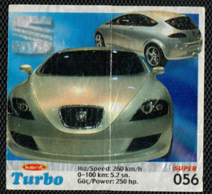</a>

	<a href='https://raw.githubusercontent.com/vlegchilkin/collection/a9406052fbc31e4ae95d9bcf9c918656ecd1f513/gum_wrappers/kent/turbo/2003/TUR/super/inner/57.4.png' title=''>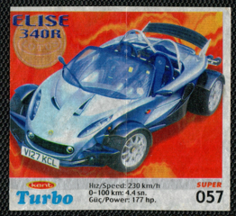</a>

	

	

	

	

	

	

	

	

	

	

	

	

	

	

	

	

	

	

	

	

	

	

	

	

	

	

	

	

	

	

	

	

	

	

	

	

	

	

	

	

	

	

