## Turbo 191-260, T4 or Fourth series.

Very wide produced in many Europe countries from 1992 till 1993, was one of the most
popular series. All car names and characteristics in black colors.

Big quantity of prototypes comparative with previous series, appear classical retro cars, produced till 1940.

### Facts

* On wrappers appears advertisements of other Kent products - Jelibon, Frutty, Kent Assortment - numbers 211, 222, 225,
  228, 231, 236, 238, 249, 254.

* First appear wrappers with 2 different cars and different characteristics - 248 Pontiac Grand Prix / Pontiac
  Bonneville and 251 Mercedes 600 SEC / Mercedes 500 SL.

### Print errors and artifacts:

* #203 might have horizontal line on top
* #218 might have red dot
* #219 might have red or blue dot in the olympic symbol in the right upper corner
* #233 might have dot below stand
* #244 might have green dot

### My collection

|       Year        |                                                                                                                 1                                                                                                                 |                                                                                                                 2                                                                                                                 |                                                                                                                 3                                                                                                                 |                                                                                                                 4                                                                                                                 |                                                                                                                 5                                                                                                                 |
|:-----------------:|:---------------------------------------------------------------------------------------------------------------------------------------------------------------------------------------------------------------------------------:|:---------------------------------------------------------------------------------------------------------------------------------------------------------------------------------------------------------------------------------:|:---------------------------------------------------------------------------------------------------------------------------------------------------------------------------------------------------------------------------------:|:---------------------------------------------------------------------------------------------------------------------------------------------------------------------------------------------------------------------------------:|:---------------------------------------------------------------------------------------------------------------------------------------------------------------------------------------------------------------------------------:|
| 1992 07 - 1992 12 |  |  |  |  |  |
| 1993 01 - 1993 12 |  |  |  |  |  |

	<a href='https://raw.githubusercontent.com/vlegchilkin/collection/86c626f322e06d4a692fe76cfe91b5638997457c/gum_wrappers/kent/turbo/black/191-260/inner/191.5.png' title=''>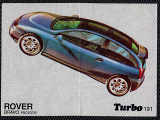</a>

	

	<a href='https://raw.githubusercontent.com/vlegchilkin/collection/86c626f322e06d4a692fe76cfe91b5638997457c/gum_wrappers/kent/turbo/black/191-260/inner/193.4.png' title=''>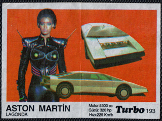</a>

	

	

	<a href='https://raw.githubusercontent.com/vlegchilkin/collection/86c626f322e06d4a692fe76cfe91b5638997457c/gum_wrappers/kent/turbo/black/191-260/inner/196.5.png' title=''>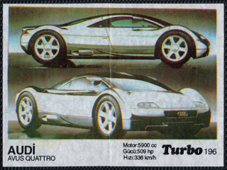</a>

	<a href='https://raw.githubusercontent.com/vlegchilkin/collection/86c626f322e06d4a692fe76cfe91b5638997457c/gum_wrappers/kent/turbo/black/191-260/inner/197.5.png' title=''>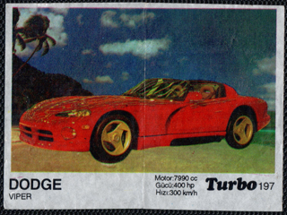</a>

	<a href='https://raw.githubusercontent.com/vlegchilkin/collection/86c626f322e06d4a692fe76cfe91b5638997457c/gum_wrappers/kent/turbo/black/191-260/inner/198.5.png' title=''>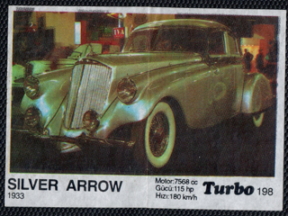</a>

	

	

	

	

	

	<a href='https://raw.githubusercontent.com/vlegchilkin/collection/86c626f322e06d4a692fe76cfe91b5638997457c/gum_wrappers/kent/turbo/black/191-260/inner/204.5.png' title=''>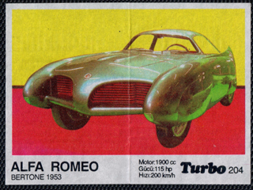</a>

	

	

	

	<a href='https://raw.githubusercontent.com/vlegchilkin/collection/86c626f322e06d4a692fe76cfe91b5638997457c/gum_wrappers/kent/turbo/black/191-260/inner/208.4.png' title=''>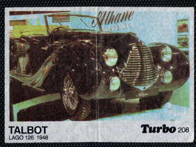</a>

	

	

	

	

	<a href='https://raw.githubusercontent.com/vlegchilkin/collection/86c626f322e06d4a692fe76cfe91b5638997457c/gum_wrappers/kent/turbo/black/191-260/inner/213.5.png' title=''>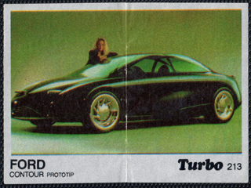</a>

	<a href='https://raw.githubusercontent.com/vlegchilkin/collection/86c626f322e06d4a692fe76cfe91b5638997457c/gum_wrappers/kent/turbo/black/191-260/inner/214.5.png' title=''>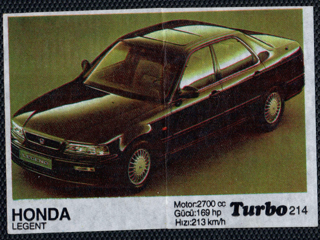</a>

	

	

	<a href='https://raw.githubusercontent.com/vlegchilkin/collection/86c626f322e06d4a692fe76cfe91b5638997457c/gum_wrappers/kent/turbo/black/191-260/inner/217.5.png' title=''>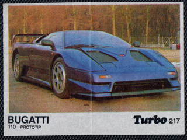</a>

	

	

	

	

	

	

	<a href='https://raw.githubusercontent.com/vlegchilkin/collection/86c626f322e06d4a692fe76cfe91b5638997457c/gum_wrappers/kent/turbo/black/191-260/inner/224.5.png' title=''>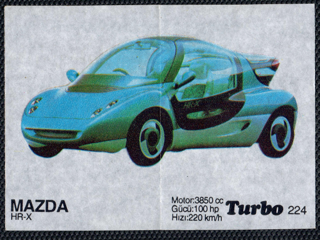</a>

	

	

	

	<a href='https://raw.githubusercontent.com/vlegchilkin/collection/86c626f322e06d4a692fe76cfe91b5638997457c/gum_wrappers/kent/turbo/black/191-260/inner/228.5.png' title=''>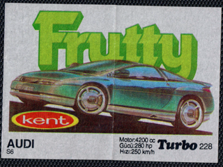</a>

	

	

	

	

	<a href='https://raw.githubusercontent.com/vlegchilkin/collection/86c626f322e06d4a692fe76cfe91b5638997457c/gum_wrappers/kent/turbo/black/191-260/inner/233.5.png' title=''>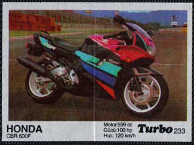</a>

	<a href='https://raw.githubusercontent.com/vlegchilkin/collection/86c626f322e06d4a692fe76cfe91b5638997457c/gum_wrappers/kent/turbo/black/191-260/inner/234.5.png' title=''>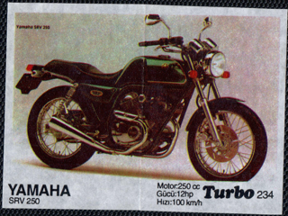</a>

	<a href='https://raw.githubusercontent.com/vlegchilkin/collection/86c626f322e06d4a692fe76cfe91b5638997457c/gum_wrappers/kent/turbo/black/191-260/inner/235.5.png' title=''>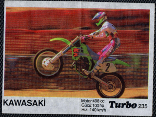</a>

	

	

	

	<a href='https://raw.githubusercontent.com/vlegchilkin/collection/86c626f322e06d4a692fe76cfe91b5638997457c/gum_wrappers/kent/turbo/black/191-260/inner/239.5.png' title=''>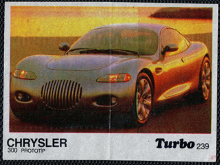</a>

	

	

	

	

	<a href='https://raw.githubusercontent.com/vlegchilkin/collection/86c626f322e06d4a692fe76cfe91b5638997457c/gum_wrappers/kent/turbo/black/191-260/inner/244.5.png' title=''>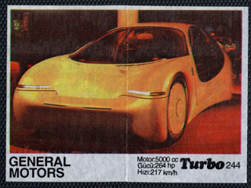</a>

	<a href='https://raw.githubusercontent.com/vlegchilkin/collection/86c626f322e06d4a692fe76cfe91b5638997457c/gum_wrappers/kent/turbo/black/191-260/inner/245.5.png' title=''>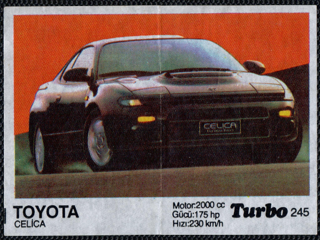</a>

	

	

	

	

	

	

	

	<a href='https://raw.githubusercontent.com/vlegchilkin/collection/86c626f322e06d4a692fe76cfe91b5638997457c/gum_wrappers/kent/turbo/black/191-260/inner/253.5.png' title=''>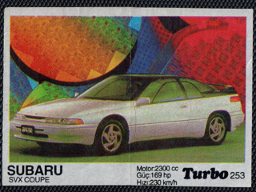</a>

	<a href='https://raw.githubusercontent.com/vlegchilkin/collection/86c626f322e06d4a692fe76cfe91b5638997457c/gum_wrappers/kent/turbo/black/191-260/inner/254.5.png' title=''>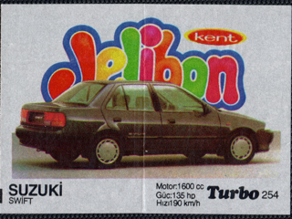</a>

	

	<a href='https://raw.githubusercontent.com/vlegchilkin/collection/86c626f322e06d4a692fe76cfe91b5638997457c/gum_wrappers/kent/turbo/black/191-260/inner/256.5.png' title=''>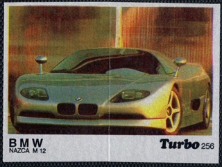</a>

	<a href='https://raw.githubusercontent.com/vlegchilkin/collection/86c626f322e06d4a692fe76cfe91b5638997457c/gum_wrappers/kent/turbo/black/191-260/inner/257.5.png' title=''>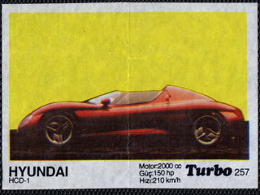</a>

	<a href='https://raw.githubusercontent.com/vlegchilkin/collection/86c626f322e06d4a692fe76cfe91b5638997457c/gum_wrappers/kent/turbo/black/191-260/inner/258.5.png' title=''>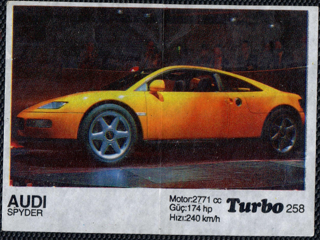</a>

	

	

