## Turbo 51-120, T2 or Second series.

By covers was produced 1987 till 1990, in many countries including ex-USSR, Romania,
Russia, Poland, Bulgaria. Contains 70 numbers from 51 till 120, all text is black, car characteristics in 3 rows,
wrappers size is 83-85 mm in width, and 60-62 mm in height, number is placed under sign Turbo like in 1st series, in
next series number is placed in right of Turbo.

All cars are real (no prototypes) on a real background, in number 78 appear text Turbo Kent over car, also appears few
cars on one wrapper - numbers 51, 85, 112, this numbers was appreciated bigger than others. Appear wrapper with vertical
image orientation - BMW 82.

### Facts:

* First repeat of image from 1st series - number 41 and 111,
* Errors in all wrappers with BMW - text BMV not BMW,

### Print errors and artifacts:

* 51 has 4 options (clean, a hair on a rear wheel, a sticker on side, or cyan marker stripe in the top-left corner):
* 94 has mark above 'motor' text (white area or dots). There a rare 'clean' version also.
* 86 might have a 'circle' mark
* 116 might have a 'circle' mark
* 120 might have a mark above the 'COROLLA' and also a green horizontal line across the wrapper

### My collection

|       Year        |                                                                                                                1                                                                                                                 |                                                                                                                2                                                                                                                 |                                                                                                                3                                                                                                                 |                                                                                                                4                                                                                                                 |                                                                                                                5                                                                                                                 |
|:-----------------:|:--------------------------------------------------------------------------------------------------------------------------------------------------------------------------------------------------------------------------------:|:--------------------------------------------------------------------------------------------------------------------------------------------------------------------------------------------------------------------------------:|:--------------------------------------------------------------------------------------------------------------------------------------------------------------------------------------------------------------------------------:|:--------------------------------------------------------------------------------------------------------------------------------------------------------------------------------------------------------------------------------:|:--------------------------------------------------------------------------------------------------------------------------------------------------------------------------------------------------------------------------------:|
| 1987 09 - 1990 06 |  | [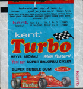](https://raw.githubusercontent.com/vlegchilkin/collection/86c626f322e06d4a692fe76cfe91b5638997457c/gum_wrappers/kent/turbo/black/51-120/outer/1987_09_-_1990_06.2.4.png) | [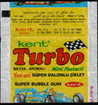](https://raw.githubusercontent.com/vlegchilkin/collection/86c626f322e06d4a692fe76cfe91b5638997457c/gum_wrappers/kent/turbo/black/51-120/outer/1987_09_-_1990_06.3.4.png) | [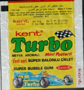](https://raw.githubusercontent.com/vlegchilkin/collection/86c626f322e06d4a692fe76cfe91b5638997457c/gum_wrappers/kent/turbo/black/51-120/outer/1987_09_-_1990_06.4.4.png) | [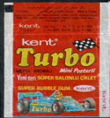](https://raw.githubusercontent.com/vlegchilkin/collection/86c626f322e06d4a692fe76cfe91b5638997457c/gum_wrappers/kent/turbo/black/51-120/outer/1987_09_-_1990_06.5.4.png) |
| 1990 07 - 1991 03 |  |  |  |  |  |

	<a href='https://raw.githubusercontent.com/vlegchilkin/collection/6531abd7dde5563257d531358fa37a176a844b3b/gum_wrappers/kent/turbo/black/51-120/inner/51.hair.5.png' title='Hair'>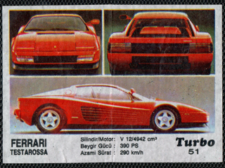</a>
	
	

	

	

	

	
	

	

	
	

	
	
	

	<a href='https://raw.githubusercontent.com/vlegchilkin/collection/6531abd7dde5563257d531358fa37a176a844b3b/gum_wrappers/kent/turbo/black/51-120/inner/59.5.png' title=''>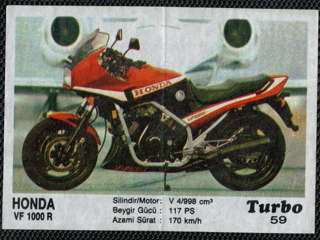</a>

	<a href='https://raw.githubusercontent.com/vlegchilkin/collection/6531abd7dde5563257d531358fa37a176a844b3b/gum_wrappers/kent/turbo/black/51-120/inner/60.5.png' title=''>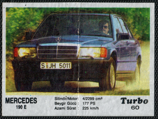</a>

	

	<a href='https://raw.githubusercontent.com/vlegchilkin/collection/6531abd7dde5563257d531358fa37a176a844b3b/gum_wrappers/kent/turbo/black/51-120/inner/62.5.png' title=''>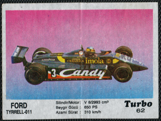</a>

	<a href='https://raw.githubusercontent.com/vlegchilkin/collection/6531abd7dde5563257d531358fa37a176a844b3b/gum_wrappers/kent/turbo/black/51-120/inner/63.5.png' title=''>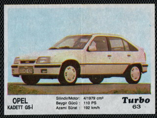</a>

	<a href='https://raw.githubusercontent.com/vlegchilkin/collection/6531abd7dde5563257d531358fa37a176a844b3b/gum_wrappers/kent/turbo/black/51-120/inner/64.5.png' title=''>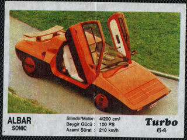</a>

	<a href='https://raw.githubusercontent.com/vlegchilkin/collection/6531abd7dde5563257d531358fa37a176a844b3b/gum_wrappers/kent/turbo/black/51-120/inner/65.5.png' title=''>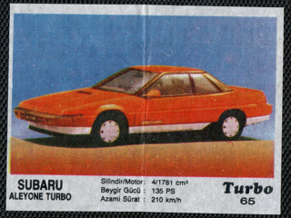</a>

	<a href='https://raw.githubusercontent.com/vlegchilkin/collection/6531abd7dde5563257d531358fa37a176a844b3b/gum_wrappers/kent/turbo/black/51-120/inner/66.5.png' title=''>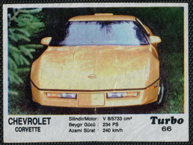</a>

	
	

	<a href='https://raw.githubusercontent.com/vlegchilkin/collection/6531abd7dde5563257d531358fa37a176a844b3b/gum_wrappers/kent/turbo/black/51-120/inner/68.5.png' title=''>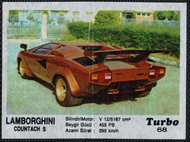</a>

	<a href='https://raw.githubusercontent.com/vlegchilkin/collection/6531abd7dde5563257d531358fa37a176a844b3b/gum_wrappers/kent/turbo/black/51-120/inner/69.5.png' title=''>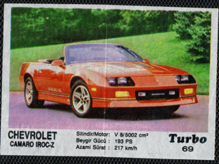</a>
	

	
	

	
	

	

	

	
	

	<a href='https://raw.githubusercontent.com/vlegchilkin/collection/6531abd7dde5563257d531358fa37a176a844b3b/gum_wrappers/kent/turbo/black/51-120/inner/75.5.png' title=''>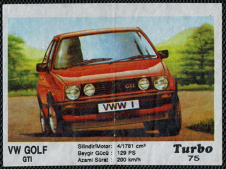</a>

	<a href='https://raw.githubusercontent.com/vlegchilkin/collection/6531abd7dde5563257d531358fa37a176a844b3b/gum_wrappers/kent/turbo/black/51-120/inner/76.5.png' title=''>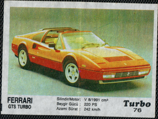</a>

	<a href='https://raw.githubusercontent.com/vlegchilkin/collection/6531abd7dde5563257d531358fa37a176a844b3b/gum_wrappers/kent/turbo/black/51-120/inner/77.5.png' title=''>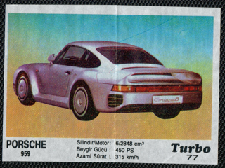</a>
	

	<a href='https://raw.githubusercontent.com/vlegchilkin/collection/6531abd7dde5563257d531358fa37a176a844b3b/gum_wrappers/kent/turbo/black/51-120/inner/78.5.png' title=''>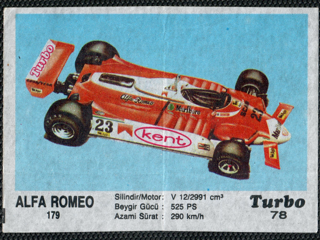</a>

	

	

	
	
	

	

	<a href='https://raw.githubusercontent.com/vlegchilkin/collection/6531abd7dde5563257d531358fa37a176a844b3b/gum_wrappers/kent/turbo/black/51-120/inner/83.5.png' title=''>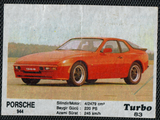</a>

	

	
	

	
	<a href='https://raw.githubusercontent.com/vlegchilkin/collection/6531abd7dde5563257d531358fa37a176a844b3b/gum_wrappers/kent/turbo/black/51-120/inner/86.circle.5.png' title='Circle'>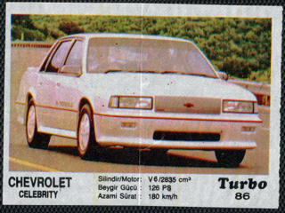</a>

	
	<a href='https://raw.githubusercontent.com/vlegchilkin/collection/6531abd7dde5563257d531358fa37a176a844b3b/gum_wrappers/kent/turbo/black/51-120/inner/87.rainbow.5.png' title='Rainbow'>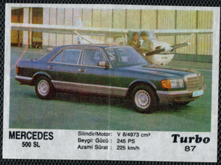</a>

	
	

	

	
	

	<a href='https://raw.githubusercontent.com/vlegchilkin/collection/6531abd7dde5563257d531358fa37a176a844b3b/gum_wrappers/kent/turbo/black/51-120/inner/91.5.png' title=''>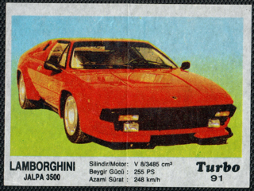</a>

	

	

	

	<a href='https://raw.githubusercontent.com/vlegchilkin/collection/6531abd7dde5563257d531358fa37a176a844b3b/gum_wrappers/kent/turbo/black/51-120/inner/95.5.png' title=''>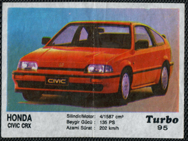</a>

	<a href='https://raw.githubusercontent.com/vlegchilkin/collection/6531abd7dde5563257d531358fa37a176a844b3b/gum_wrappers/kent/turbo/black/51-120/inner/96.5.png' title=''>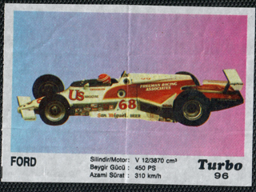</a>
	
	

	<a href='https://raw.githubusercontent.com/vlegchilkin/collection/6531abd7dde5563257d531358fa37a176a844b3b/gum_wrappers/kent/turbo/black/51-120/inner/97.4.png' title=''>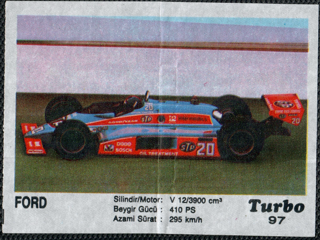</a>
	

	

	<a href='https://raw.githubusercontent.com/vlegchilkin/collection/6531abd7dde5563257d531358fa37a176a844b3b/gum_wrappers/kent/turbo/black/51-120/inner/99.5.png' title=''>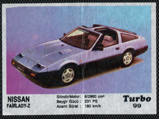</a>

	<a href='https://raw.githubusercontent.com/vlegchilkin/collection/6531abd7dde5563257d531358fa37a176a844b3b/gum_wrappers/kent/turbo/black/51-120/inner/100.5.png' title=''>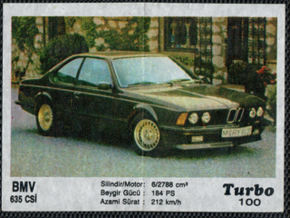</a>

	<a href='https://raw.githubusercontent.com/vlegchilkin/collection/6531abd7dde5563257d531358fa37a176a844b3b/gum_wrappers/kent/turbo/black/51-120/inner/101.5.png' title=''>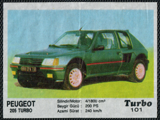</a>
	

	<a href='https://raw.githubusercontent.com/vlegchilkin/collection/6531abd7dde5563257d531358fa37a176a844b3b/gum_wrappers/kent/turbo/black/51-120/inner/102.5.png' title=''>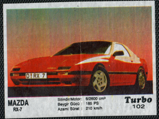</a>

	

	
	

	
	

	
	

	<a href='https://raw.githubusercontent.com/vlegchilkin/collection/6531abd7dde5563257d531358fa37a176a844b3b/gum_wrappers/kent/turbo/black/51-120/inner/107.5.png' title=''>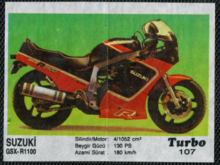</a>
	

	

	

	<a href='https://raw.githubusercontent.com/vlegchilkin/collection/6531abd7dde5563257d531358fa37a176a844b3b/gum_wrappers/kent/turbo/black/51-120/inner/110.5.png' title=''>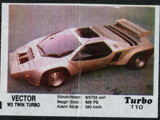</a>
	

	
	

	
	

	
	

	
	
	

	

	<a href='https://raw.githubusercontent.com/vlegchilkin/collection/6531abd7dde5563257d531358fa37a176a844b3b/gum_wrappers/kent/turbo/black/51-120/inner/116.5.png' title=''>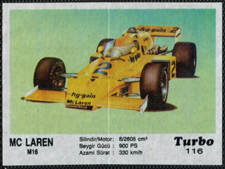</a>
	
	

	<a href='https://raw.githubusercontent.com/vlegchilkin/collection/6531abd7dde5563257d531358fa37a176a844b3b/gum_wrappers/kent/turbo/black/51-120/inner/117.5.png' title=''>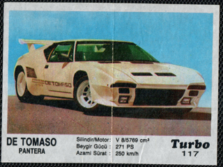</a>
	

	

	
	

	<a href='https://raw.githubusercontent.com/vlegchilkin/collection/6531abd7dde5563257d531358fa37a176a844b3b/gum_wrappers/kent/turbo/black/51-120/inner/120.5.png' title=''>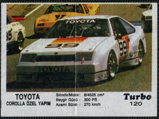</a>
	
	

