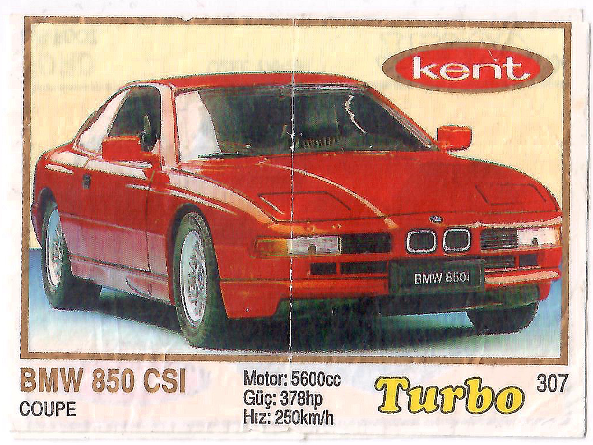
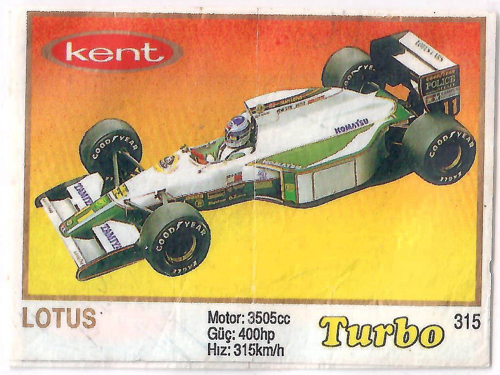
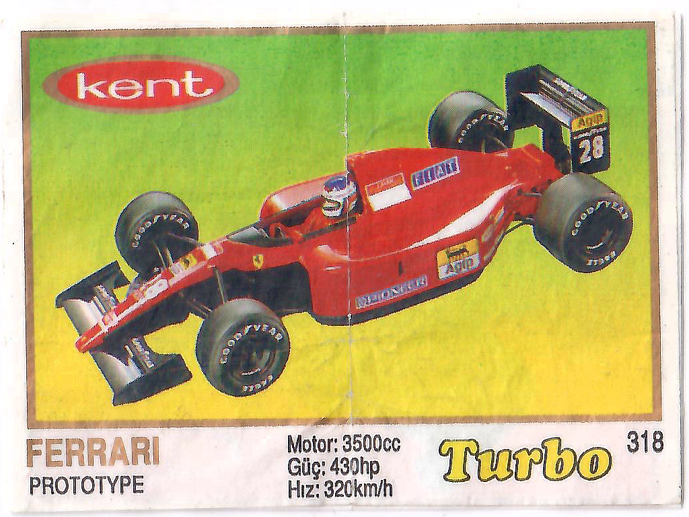
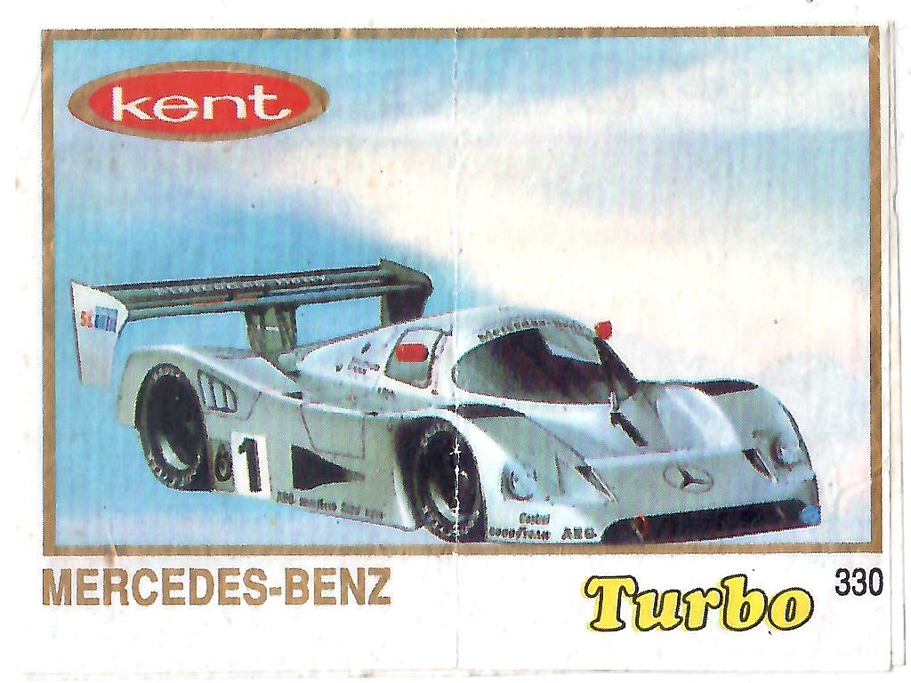
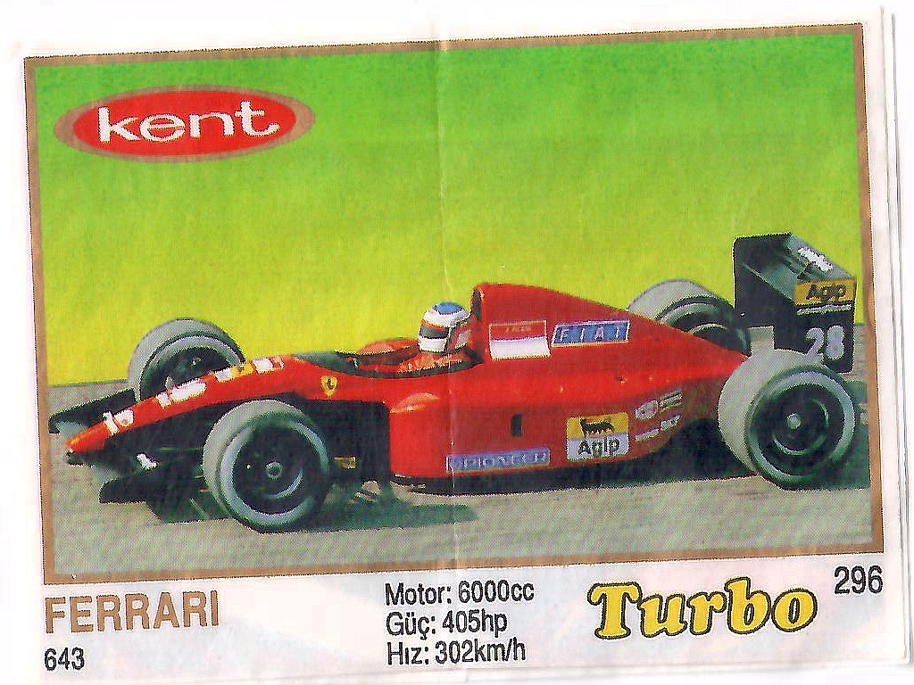
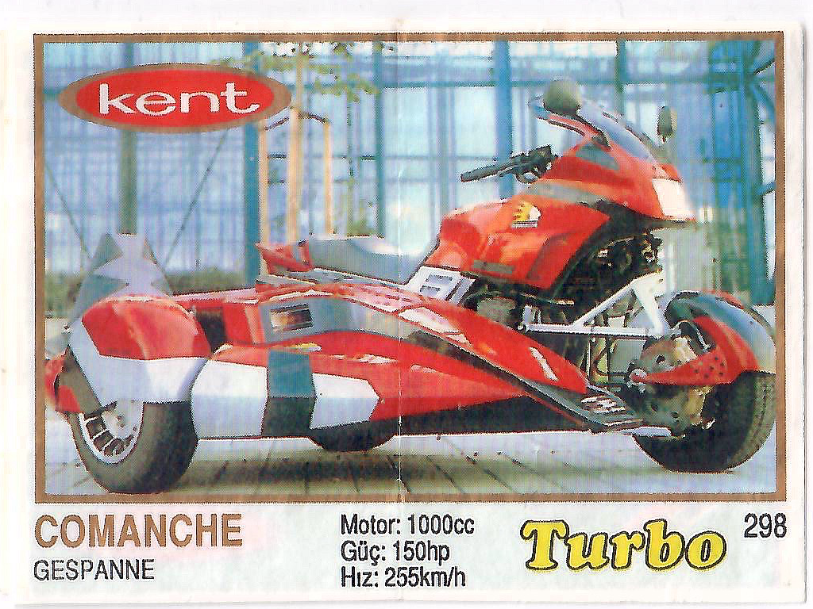
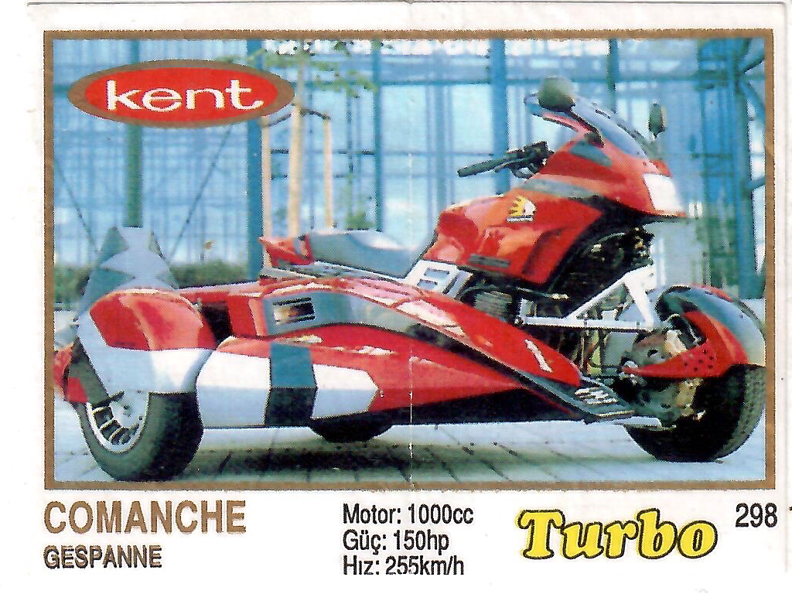
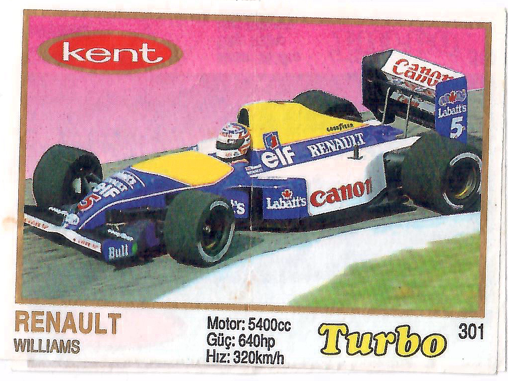

## Turbo 261-330, T5 of Fifth series.

Produced in 1993 till 1994.

First is used yellow colot for sign Turbo. Wrappers have border on images. Number, characteristics and model - in black
color, car name and border - from gold to silver. Appears planes and boats, and 5th series was very wide distributed.

There are multiple revisions of this series by border color and border width - [Thin frame](thin) (silver and gold) and 
[Thick frame](thick) (gold, silver and brown metallic). On revision with Thin silver frame appears many questions and doubts that such
type of wrappers was found only a few pieces and they have the following essential wear (fading).

In different revisions not coincide wrappers, difference can be found dividing by frame width. Wrappers are scaled
different, border hide partially an car image.

**Facts**

* Wrapper # 307 thick frame has plate "BMW 850i", in thin frame only "BMW".

  
  

* Wrappers #315 and #318 with different frame width have swapped images.

  
  

  
  

* Wrapper #330 with thick frame have extended spoiler.

  
  

* Wrappers #296 and thick#318 / thin#315 - is the same car but with different characteristics, and one of them
  named prototype but is real Ferrari 643, from 1991 season 1 of Formula 1.

  
  

  
  

* Wrapper #298 & #301 might have gold title (GESPANNE, WILLIAMS)

  
  

  
  
