## Turbo Super 331-400

### My collection

|       Year        |                                                                                                                 1                                                                                                                 |                                                                                                                 2                                                                                                                 |                                                                                                                 3                                                                                                                 |                                                                                                                 4                                                                                                                 |                                                                                                                 5                                                                                                                 |
|:-----------------:|:---------------------------------------------------------------------------------------------------------------------------------------------------------------------------------------------------------------------------------:|:---------------------------------------------------------------------------------------------------------------------------------------------------------------------------------------------------------------------------------:|:---------------------------------------------------------------------------------------------------------------------------------------------------------------------------------------------------------------------------------:|:---------------------------------------------------------------------------------------------------------------------------------------------------------------------------------------------------------------------------------:|:---------------------------------------------------------------------------------------------------------------------------------------------------------------------------------------------------------------------------------:|
| 1994 11 - 1995 03 | [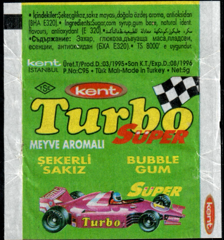](https://raw.githubusercontent.com/vlegchilkin/collection/fe295a49d37dbe49ca4ed2cf7916549d37942f37/gum_wrappers/kent/turbo/super/331-400/outer/1994_11_-_1995_03.1.5.png) |  |  | [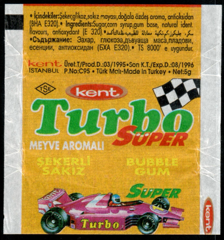](https://raw.githubusercontent.com/vlegchilkin/collection/fe295a49d37dbe49ca4ed2cf7916549d37942f37/gum_wrappers/kent/turbo/super/331-400/outer/1994_11_-_1995_03.4.5.png) |  |

	

	

	<a href='https://raw.githubusercontent.com/vlegchilkin/collection/f03343bc1ba5e767d891df75b8018dde37d03f84/gum_wrappers/kent/turbo/super/331-400/inner/333.4.png' title=''>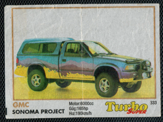</a>

	<a href='https://raw.githubusercontent.com/vlegchilkin/collection/f03343bc1ba5e767d891df75b8018dde37d03f84/gum_wrappers/kent/turbo/super/331-400/inner/334.5.png' title=''>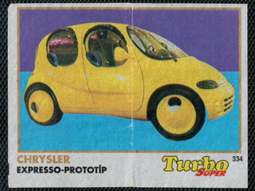</a>

	

	

	

	

	<a href='https://raw.githubusercontent.com/vlegchilkin/collection/f03343bc1ba5e767d891df75b8018dde37d03f84/gum_wrappers/kent/turbo/super/331-400/inner/339.5.png' title=''>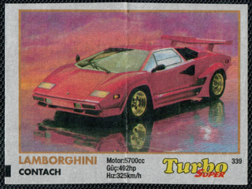</a>

	

	<a href='https://raw.githubusercontent.com/vlegchilkin/collection/f03343bc1ba5e767d891df75b8018dde37d03f84/gum_wrappers/kent/turbo/super/331-400/inner/341.5.png' title=''>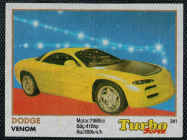</a>

	

	<a href='https://raw.githubusercontent.com/vlegchilkin/collection/f03343bc1ba5e767d891df75b8018dde37d03f84/gum_wrappers/kent/turbo/super/331-400/inner/343.5.png' title=''>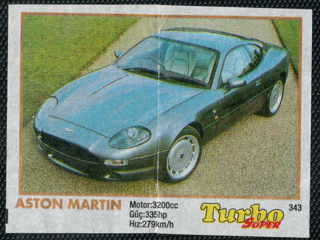</a>

	

	

	<a href='https://raw.githubusercontent.com/vlegchilkin/collection/f03343bc1ba5e767d891df75b8018dde37d03f84/gum_wrappers/kent/turbo/super/331-400/inner/346.5.png' title=''>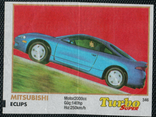</a>

	

	

	

	

	

	

	

	<a href='https://raw.githubusercontent.com/vlegchilkin/collection/f03343bc1ba5e767d891df75b8018dde37d03f84/gum_wrappers/kent/turbo/super/331-400/inner/354.5.png' title=''>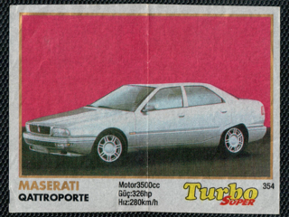</a>

	

	

	

	

	

	

	

	

	<a href='https://raw.githubusercontent.com/vlegchilkin/collection/f03343bc1ba5e767d891df75b8018dde37d03f84/gum_wrappers/kent/turbo/super/331-400/inner/363.5.png' title=''>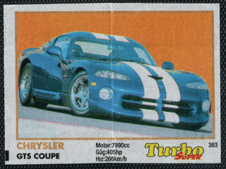</a>

	<a href='https://raw.githubusercontent.com/vlegchilkin/collection/f03343bc1ba5e767d891df75b8018dde37d03f84/gum_wrappers/kent/turbo/super/331-400/inner/364.5.png' title=''>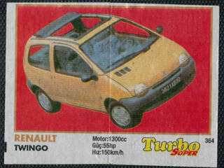</a>

	

	

	

	<a href='https://raw.githubusercontent.com/vlegchilkin/collection/f03343bc1ba5e767d891df75b8018dde37d03f84/gum_wrappers/kent/turbo/super/331-400/inner/368.5.png' title=''>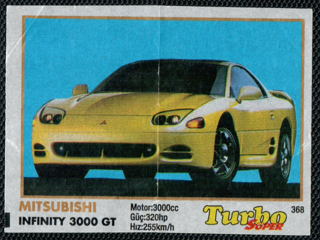</a>

	

	

	

	<a href='https://raw.githubusercontent.com/vlegchilkin/collection/f03343bc1ba5e767d891df75b8018dde37d03f84/gum_wrappers/kent/turbo/super/331-400/inner/372.5.png' title=''>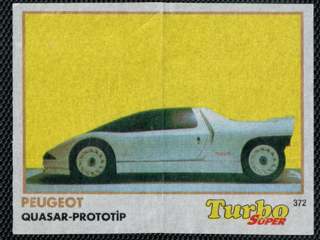</a>

	<a href='https://raw.githubusercontent.com/vlegchilkin/collection/f03343bc1ba5e767d891df75b8018dde37d03f84/gum_wrappers/kent/turbo/super/331-400/inner/373.5.png' title=''>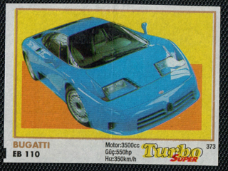</a>

	

	

	

	

	

	

	<a href='https://raw.githubusercontent.com/vlegchilkin/collection/f03343bc1ba5e767d891df75b8018dde37d03f84/gum_wrappers/kent/turbo/super/331-400/inner/380.5.png' title=''>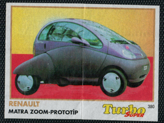</a>

	

	<a href='https://raw.githubusercontent.com/vlegchilkin/collection/f03343bc1ba5e767d891df75b8018dde37d03f84/gum_wrappers/kent/turbo/super/331-400/inner/382.3.png' title=''>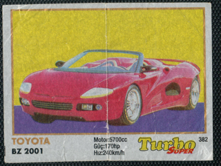</a>

	

	<a href='https://raw.githubusercontent.com/vlegchilkin/collection/f03343bc1ba5e767d891df75b8018dde37d03f84/gum_wrappers/kent/turbo/super/331-400/inner/384.5.png' title=''>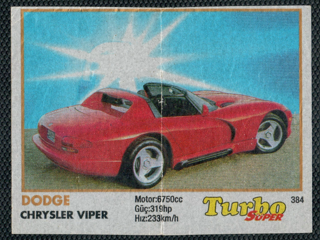</a>

	

	

	

	

	

	

	<a href='https://raw.githubusercontent.com/vlegchilkin/collection/f03343bc1ba5e767d891df75b8018dde37d03f84/gum_wrappers/kent/turbo/super/331-400/inner/391.5.png' title=''>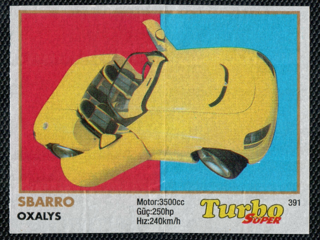</a>

	

	<a href='https://raw.githubusercontent.com/vlegchilkin/collection/f03343bc1ba5e767d891df75b8018dde37d03f84/gum_wrappers/kent/turbo/super/331-400/inner/393.5.png' title=''>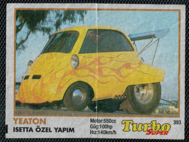</a>

	

	

	

	

	

	

	

