## Turbo Super 401-470

### My collection

|       Year        |                                                                                                                 1                                                                                                                 |                                                                                                                 2                                                                                                                 |                                                                                                                 3                                                                                                                 |                                                                                                                 4                                                                                                                 |                                                                                                                 5                                                                                                                 |
|:-----------------:|:---------------------------------------------------------------------------------------------------------------------------------------------------------------------------------------------------------------------------------:|:---------------------------------------------------------------------------------------------------------------------------------------------------------------------------------------------------------------------------------:|:---------------------------------------------------------------------------------------------------------------------------------------------------------------------------------------------------------------------------------:|:---------------------------------------------------------------------------------------------------------------------------------------------------------------------------------------------------------------------------------:|:---------------------------------------------------------------------------------------------------------------------------------------------------------------------------------------------------------------------------------:|
| 1995 03 - 1996 07 |  |  |  |  |  |

	

	

	<a href='https://raw.githubusercontent.com/vlegchilkin/collection/f03343bc1ba5e767d891df75b8018dde37d03f84/gum_wrappers/kent/turbo/super/401-470/inner/403.5.png' title=''>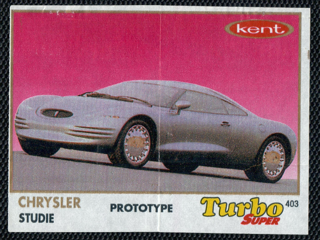</a>

	

	<a href='https://raw.githubusercontent.com/vlegchilkin/collection/f03343bc1ba5e767d891df75b8018dde37d03f84/gum_wrappers/kent/turbo/super/401-470/inner/405.5.png' title=''>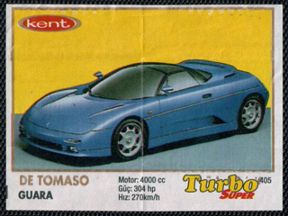</a>

	<a href='https://raw.githubusercontent.com/vlegchilkin/collection/f03343bc1ba5e767d891df75b8018dde37d03f84/gum_wrappers/kent/turbo/super/401-470/inner/406.5.png' title=''>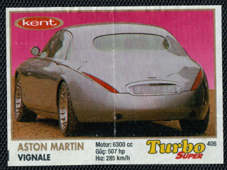</a>

	<a href='https://raw.githubusercontent.com/vlegchilkin/collection/f03343bc1ba5e767d891df75b8018dde37d03f84/gum_wrappers/kent/turbo/super/401-470/inner/407.5.png' title=''>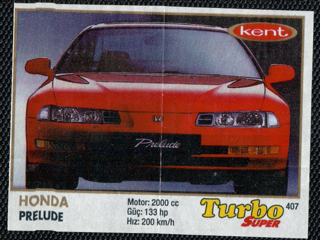</a>

	

	<a href='https://raw.githubusercontent.com/vlegchilkin/collection/f03343bc1ba5e767d891df75b8018dde37d03f84/gum_wrappers/kent/turbo/super/401-470/inner/409.5.png' title=''>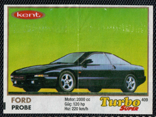</a>

	

	

	

	

	

	

	

	

	

	

	

	

	

	<a href='https://raw.githubusercontent.com/vlegchilkin/collection/f03343bc1ba5e767d891df75b8018dde37d03f84/gum_wrappers/kent/turbo/super/401-470/inner/423.5.png' title=''>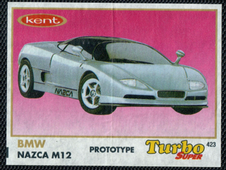</a>

	<a href='https://raw.githubusercontent.com/vlegchilkin/collection/f03343bc1ba5e767d891df75b8018dde37d03f84/gum_wrappers/kent/turbo/super/401-470/inner/424.4.png' title=''>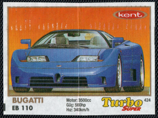</a>

	

	

	

	

	

	

	

	

	

	

	

	<a href='https://raw.githubusercontent.com/vlegchilkin/collection/f03343bc1ba5e767d891df75b8018dde37d03f84/gum_wrappers/kent/turbo/super/401-470/inner/436.5.png' title=''>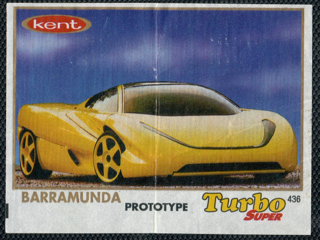</a>

	

	

	<a href='https://raw.githubusercontent.com/vlegchilkin/collection/f03343bc1ba5e767d891df75b8018dde37d03f84/gum_wrappers/kent/turbo/super/401-470/inner/439.5.png' title=''>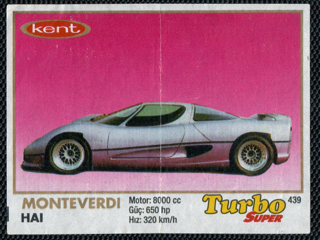</a>

	

	

	

	

	

	

	

	<a href='https://raw.githubusercontent.com/vlegchilkin/collection/f03343bc1ba5e767d891df75b8018dde37d03f84/gum_wrappers/kent/turbo/super/401-470/inner/447.5.png' title=''>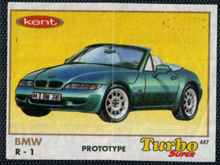</a>

	

	

	

	

	

	

	

	

	

	

	

	<a href='https://raw.githubusercontent.com/vlegchilkin/collection/f03343bc1ba5e767d891df75b8018dde37d03f84/gum_wrappers/kent/turbo/super/401-470/inner/459.5.png' title=''>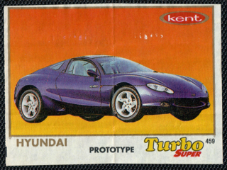</a>

	

	

	

	

	

	

	

	<a href='https://raw.githubusercontent.com/vlegchilkin/collection/f03343bc1ba5e767d891df75b8018dde37d03f84/gum_wrappers/kent/turbo/super/401-470/inner/467.5.png' title=''>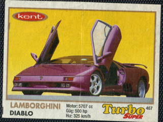</a>

	<a href='https://raw.githubusercontent.com/vlegchilkin/collection/f03343bc1ba5e767d891df75b8018dde37d03f84/gum_wrappers/kent/turbo/super/401-470/inner/468.5.png' title=''>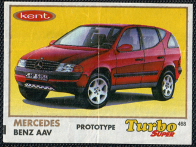</a>

	

	

