## Turbo Super 471-540

### My collection

|            Year            |                                                                                                                      1                                                                                                                      |                                                                                                                      2                                                                                                                      |                                                                                                                      3                                                                                                                      |                                                                                                                      4                                                                                                                      |                                                                                                                      5                                                                                                                      |                                                                                                                      6                                                                                                                      |                                                                                                                      7                                                                                                                      |                                                                                                                      8                                                                                                                      |                                                                                                                      9                                                                                                                      |                                                                                                                      10                                                                                                                       |
|:--------------------------:|:-------------------------------------------------------------------------------------------------------------------------------------------------------------------------------------------------------------------------------------------:|:-------------------------------------------------------------------------------------------------------------------------------------------------------------------------------------------------------------------------------------------:|:-------------------------------------------------------------------------------------------------------------------------------------------------------------------------------------------------------------------------------------------:|:-------------------------------------------------------------------------------------------------------------------------------------------------------------------------------------------------------------------------------------------:|:-------------------------------------------------------------------------------------------------------------------------------------------------------------------------------------------------------------------------------------------:|:-------------------------------------------------------------------------------------------------------------------------------------------------------------------------------------------------------------------------------------------:|:-------------------------------------------------------------------------------------------------------------------------------------------------------------------------------------------------------------------------------------------:|:-------------------------------------------------------------------------------------------------------------------------------------------------------------------------------------------------------------------------------------------:|:-------------------------------------------------------------------------------------------------------------------------------------------------------------------------------------------------------------------------------------------:|:---------------------------------------------------------------------------------------------------------------------------------------------------------------------------------------------------------------------------------------------:|
| (r0) 1996 10 - 1999 06 | +1996_10_-_1999_06.1.5.png) | +1996_10_-_1999_06.2.5.png) | +1996_10_-_1999_06.3.5.png) | +1996_10_-_1999_06.4.5.png) | +1996_10_-_1999_06.5.5.png) | +1996_10_-_1999_06.6.5.png) | +1996_10_-_1999_06.7.5.png) | +1996_10_-_1999_06.8.5.png) | +1996_10_-_1999_06.9.5.png) | +1996_10_-_1999_06.10.5.png) |

	

	<a href='https://raw.githubusercontent.com/vlegchilkin/collection/c7f6777e459ed44ff4591ae8b9bd2298dc9cea7d/gum_wrappers/kent/turbo/super/471-540/inner/472.5.png' title=''>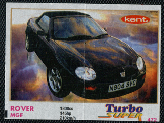</a>

	

	

	

	

	

	

	

	

	<a href='https://raw.githubusercontent.com/vlegchilkin/collection/c7f6777e459ed44ff4591ae8b9bd2298dc9cea7d/gum_wrappers/kent/turbo/super/471-540/inner/481.5.png' title=''>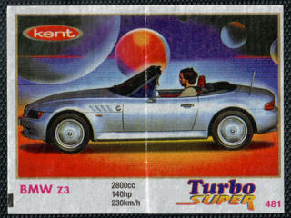</a>

	

	<a href='https://raw.githubusercontent.com/vlegchilkin/collection/c7f6777e459ed44ff4591ae8b9bd2298dc9cea7d/gum_wrappers/kent/turbo/super/471-540/inner/483.5.png' title=''>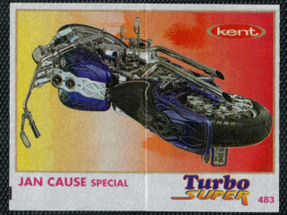</a>

	

	<a href='https://raw.githubusercontent.com/vlegchilkin/collection/c7f6777e459ed44ff4591ae8b9bd2298dc9cea7d/gum_wrappers/kent/turbo/super/471-540/inner/485.5.png' title=''>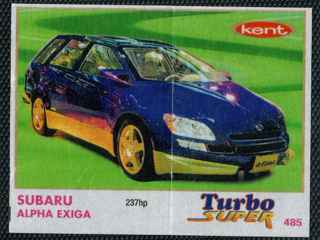</a>

	

	

	

	<a href='https://raw.githubusercontent.com/vlegchilkin/collection/c7f6777e459ed44ff4591ae8b9bd2298dc9cea7d/gum_wrappers/kent/turbo/super/471-540/inner/489.5.png' title=''>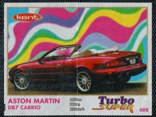</a>

	

	

	<a href='https://raw.githubusercontent.com/vlegchilkin/collection/c7f6777e459ed44ff4591ae8b9bd2298dc9cea7d/gum_wrappers/kent/turbo/super/471-540/inner/492.5.png' title=''>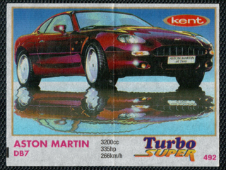</a>

	
	

	

	

	<a href='https://raw.githubusercontent.com/vlegchilkin/collection/c7f6777e459ed44ff4591ae8b9bd2298dc9cea7d/gum_wrappers/kent/turbo/super/471-540/inner/496.5.png' title=''>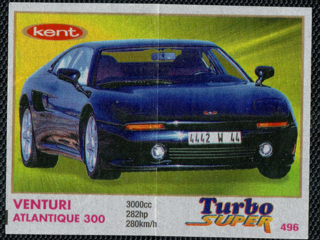</a>

	

	<a href='https://raw.githubusercontent.com/vlegchilkin/collection/c7f6777e459ed44ff4591ae8b9bd2298dc9cea7d/gum_wrappers/kent/turbo/super/471-540/inner/498.5.png' title=''>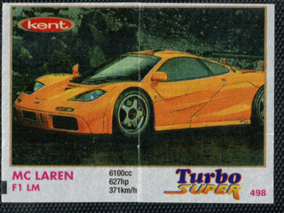</a>

	<a href='https://raw.githubusercontent.com/vlegchilkin/collection/c7f6777e459ed44ff4591ae8b9bd2298dc9cea7d/gum_wrappers/kent/turbo/super/471-540/inner/499.5.png' title=''>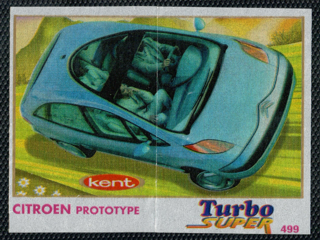</a>

	

	

	

	

	

	

	

	

	

	<a href='https://raw.githubusercontent.com/vlegchilkin/collection/c7f6777e459ed44ff4591ae8b9bd2298dc9cea7d/gum_wrappers/kent/turbo/super/471-540/inner/509.5.png' title=''>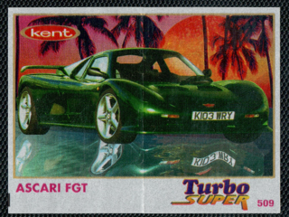</a>

	<a href='https://raw.githubusercontent.com/vlegchilkin/collection/c7f6777e459ed44ff4591ae8b9bd2298dc9cea7d/gum_wrappers/kent/turbo/super/471-540/inner/510.5.png' title=''>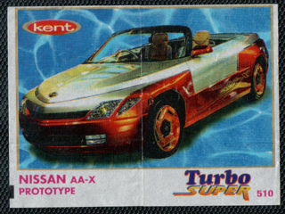</a>

	<a href='https://raw.githubusercontent.com/vlegchilkin/collection/c7f6777e459ed44ff4591ae8b9bd2298dc9cea7d/gum_wrappers/kent/turbo/super/471-540/inner/511.5.png' title=''>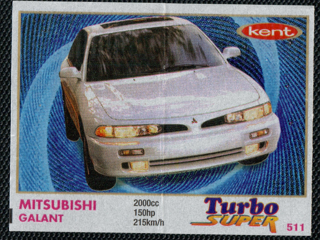</a>

	<a href='https://raw.githubusercontent.com/vlegchilkin/collection/c7f6777e459ed44ff4591ae8b9bd2298dc9cea7d/gum_wrappers/kent/turbo/super/471-540/inner/512.5.png' title=''>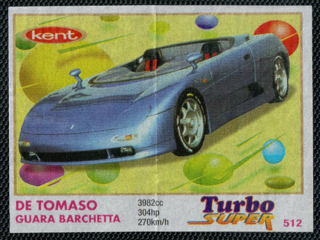</a>

	

	<a href='https://raw.githubusercontent.com/vlegchilkin/collection/c7f6777e459ed44ff4591ae8b9bd2298dc9cea7d/gum_wrappers/kent/turbo/super/471-540/inner/514.5.png' title=''>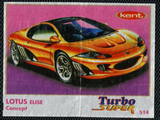</a>

	

	

	<a href='https://raw.githubusercontent.com/vlegchilkin/collection/c7f6777e459ed44ff4591ae8b9bd2298dc9cea7d/gum_wrappers/kent/turbo/super/471-540/inner/517.5.png' title=''>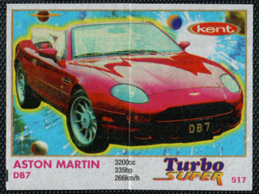</a>

	

	

	

	<a href='https://raw.githubusercontent.com/vlegchilkin/collection/c7f6777e459ed44ff4591ae8b9bd2298dc9cea7d/gum_wrappers/kent/turbo/super/471-540/inner/521.5.png' title=''>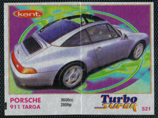</a>

	

	<a href='https://raw.githubusercontent.com/vlegchilkin/collection/c7f6777e459ed44ff4591ae8b9bd2298dc9cea7d/gum_wrappers/kent/turbo/super/471-540/inner/523.5.png' title=''>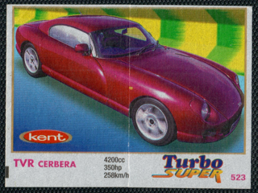</a>

	

	

	

	<a href='https://raw.githubusercontent.com/vlegchilkin/collection/c7f6777e459ed44ff4591ae8b9bd2298dc9cea7d/gum_wrappers/kent/turbo/super/471-540/inner/527.5.png' title=''>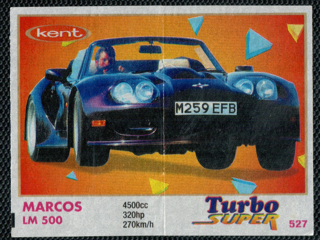</a>

	

	<a href='https://raw.githubusercontent.com/vlegchilkin/collection/c7f6777e459ed44ff4591ae8b9bd2298dc9cea7d/gum_wrappers/kent/turbo/super/471-540/inner/529.5.png' title=''>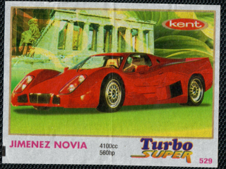</a>

	

	

	

	<a href='https://raw.githubusercontent.com/vlegchilkin/collection/c7f6777e459ed44ff4591ae8b9bd2298dc9cea7d/gum_wrappers/kent/turbo/super/471-540/inner/533.5.png' title=''>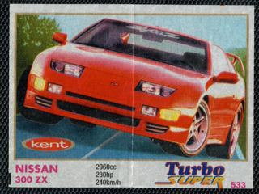</a>

	

	
	

	<a href='https://raw.githubusercontent.com/vlegchilkin/collection/c7f6777e459ed44ff4591ae8b9bd2298dc9cea7d/gum_wrappers/kent/turbo/super/471-540/inner/536.5.png' title=''>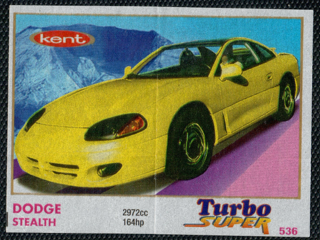</a>

	

	

	

	<a href='https://raw.githubusercontent.com/vlegchilkin/collection/c7f6777e459ed44ff4591ae8b9bd2298dc9cea7d/gum_wrappers/kent/turbo/super/471-540/inner/540.5.png' title=''>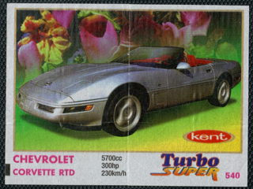</a>

